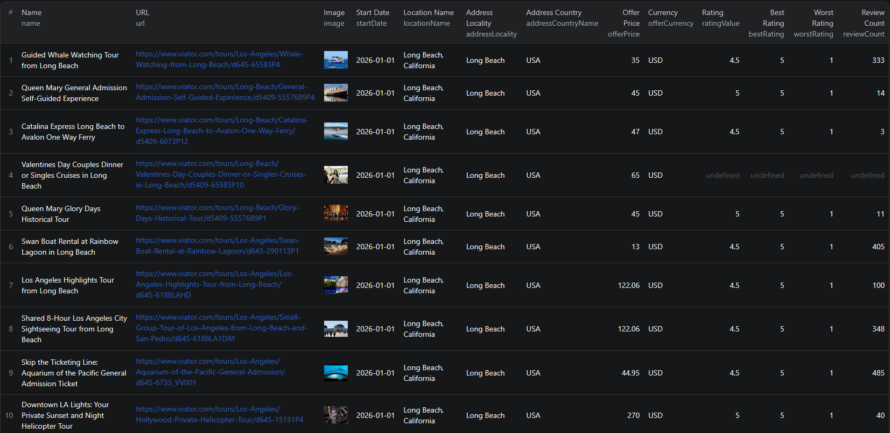

# How to Scrape Viator in Node.js

This example shows how to scrape Viator tour listings in Node.js using the [Viator Scraper](https://apify.com/piotrv1001/viator-scraper) actor on Apify — no browser automation or custom scraping code required.



## What this example does

- Passes a Viator search URL as input to the actor
- Calls the actor via the Apify API and waits for the run to finish
- Fetches results from the run's dataset
- Prints each tour listing to the console

## Prerequisites

- [Node.js](https://nodejs.org/) v18 or higher
- An [Apify account](https://console.apify.com/sign-up)
- An [Apify API token](https://console.apify.com/account/integrations)

## Installation

```bash
npm install
```

## Environment setup

Copy `.env.example` to `.env` and add your Apify API token:

```bash
cp .env.example .env
```

Then edit `.env`:

```env
APIFY_TOKEN=your_apify_token_here
```

## Usage

```bash
npm start
```

## Code example

```js
import { ApifyClient } from 'apify-client';
import 'dotenv/config';

// Initialize the ApifyClient with your Apify API token
// Set APIFY_TOKEN in your .env file (copy .env.example to get started)
const client = new ApifyClient({
    token: process.env.APIFY_TOKEN,
});

// Prepare Actor input
const input = {
    "searchUrls": [
        "https://www.viator.com/Boston-tours/Bus-and-Minivan-Tours/d678-g12-c98"
    ]
};

// Run the Actor and wait for it to finish
const run = await client.actor("piotrv1001/viator-scraper").call(input);

// Fetch and print Actor results from the run's dataset (if any)
console.log('Results from dataset');
console.log(`💾 Check your data here: https://console.apify.com/storage/datasets/${run.defaultDatasetId}`);
const { items } = await client.dataset(run.defaultDatasetId).listItems();
items.forEach((item) => {
    console.dir(item);
});

// 📚 Want to learn more 📖? Go to → https://docs.apify.com/api/client/js/docs
```

## Example output

See [`sample-output.json`](./sample-output.json) for a full example. Each result includes:

| Field | Description |
|-------|-------------|
| `name` | Tour title |
| `url` | Direct Viator listing URL |
| `image` | Tour thumbnail image URL |
| `startDate` | Earliest available date |
| `locationName` | Full location name |
| `addressLocality` | City |
| `addressCountryName` | Country |
| `offerPrice` | Price per person |
| `offerCurrency` | Currency code (e.g. `USD`) |
| `ratingValue` | Average star rating |
| `bestRating` | Maximum possible rating |
| `worstRating` | Minimum possible rating |
| `reviewCount` | Total number of reviews |

## Use cases

- **Price monitoring** — track tour prices across destinations and detect changes over time
- **Competitor analysis** — benchmark your tour offerings against similar listings in a market
- **Travel app development** — power a tour recommendation engine with structured activity data
- **Market research** — analyze review counts and ratings to identify high-demand experiences
- **Lead generation** — build lists of tour operators in specific cities or categories

## Try the actor on Apify

**[Open the Viator Scraper on Apify](https://apify.com/piotrv1001/viator-scraper)**

## License

MIT
